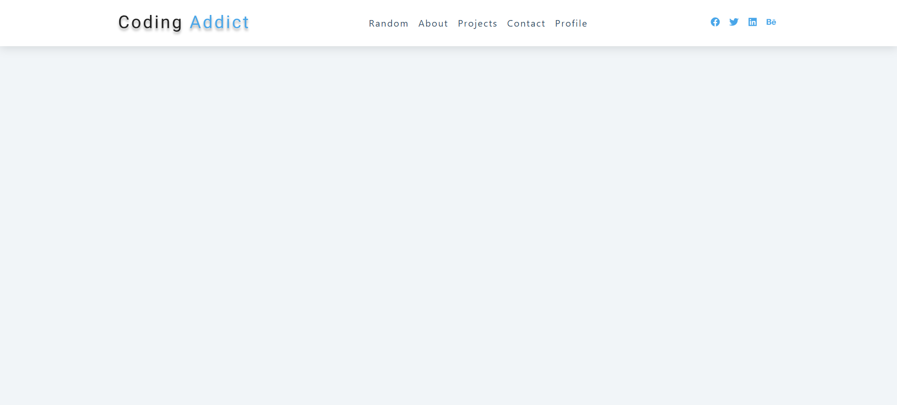
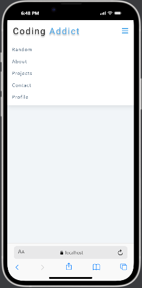
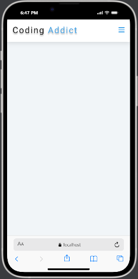
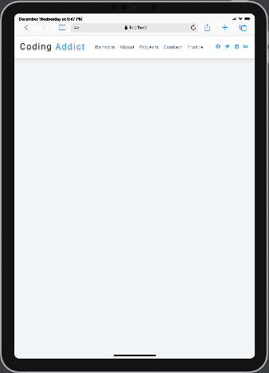

# 🚀 Responsive React Navbar

A modern, high-performance, and fully responsive navigation bar component built with **React**. This component provides a seamless user experience across all devices, featuring a dynamic data-driven architecture for easy maintenance and scalability.

## 📸 Screenshots

### Desktop View


### Mobile View Open


### Mobile View Close


### Tablet View


---

## ✨ Key Features

- **📱 Fully Responsive**: Optimized for Desktop, Tablet, and Mobile using CSS Flexbox and Media Queries.
- **🍔 Interactive Mobile Menu**: Smooth toggle functionality for navigation links on smaller screens with optimized transitions.
- **🔗 Data-Driven Architecture**: Navigation links and social media icons are managed via external data files, allowing updates without modifying component logic.
- **🌐 Social Media Integration**: Built-in support for popular social platforms using `react-icons`.
- **⚡ Performance Optimized**: Lightweight component structure ensuring fast render times and minimal re-renders.

## 🛠️ Technologies Used

- **React.js**: Core library for building the user interface.
- **React Icons**: For scalable vector icons.
- **CSS3**: Custom styling utilizing Flexbox for robust layout management.

## 🚀 Getting Started

Follow these steps to get the project up and running locally.

### Prerequisites

- Node.js (v14 or higher recommended)
- npm or yarn

### Installation

1. Clone the repository:
   ```bash
   git clone https://github.com/aadhar41/responsive-react-navbar.git
   ```
2. Navigate to the project directory:
   ```bash
   cd navbar
   ```
3. Install dependencies:
   ```bash
   npm install
   ```

### Running the Application

Start the development server:
```bash
npm start
```
Open [http://localhost:3000](http://localhost:3000) to view it in your browser. The page will reload automatically when you make changes.

## 📂 Project Structure

- `src/Navbar.js`: Main component logic and structure.
- `src/data.js`: Configuration file for links and social icons.
- `src/index.css`: Component-specific styles and responsive breakpoints.
