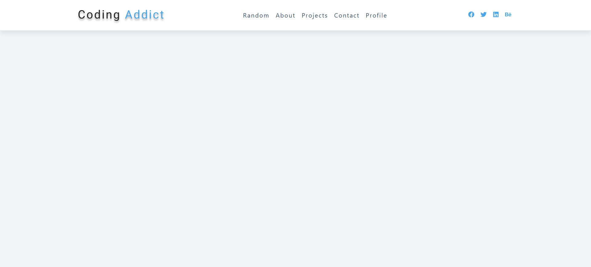
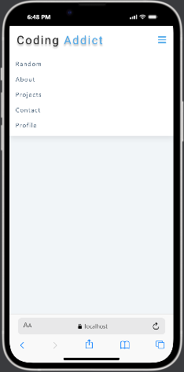
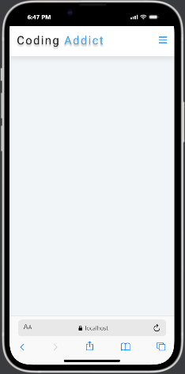
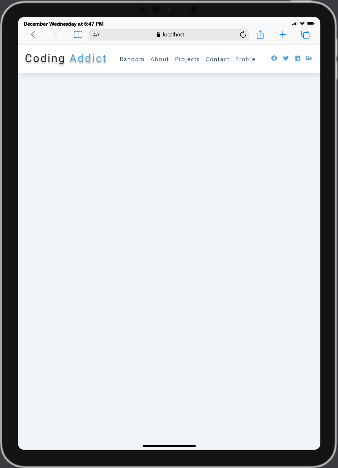

# 🚀 Responsive React Navbar

A modern, high-performance, and fully responsive navigation bar component built with **React**. This component provides a seamless user experience across all devices, featuring a dynamic data-driven architecture for easy maintenance and scalability.

## 📸 Screens

| View | Preview |
| :--- | :--- |
| **Desktop View** |  |
| **Mobile View (Open)** |  |
| **Mobile View (Closed)** |  |
| **Tablet View** |  |

---

## 🤝 Community & Contributions

Contributions are what make the open-source community such an amazing place to learn, inspire, and create. Any contributions you make are **greatly appreciated**.

- **Code of Conduct**: Please read our [Code of Conduct](CODE_OF_CONDUCT.md) to understand the standards of behavior we expect in our community.
- **Contributing**: Check out the [Contributing Guidelines](CONTRIBUTING.md) for details on our code of conduct and the process for submitting pull requests.
- **Security**: Please refer to our [Security Policy](SECURITY.md).
- **Issue Templates**: When opening an issue, please use the provided [Bug Report](.github/ISSUE_TEMPLATE/bug_report.md) or [Feature Request](.github/ISSUE_TEMPLATE/feature_request.md) templates.

---

## 📜 License

Distributed under the MIT License. See `LICENSE` for more information.
